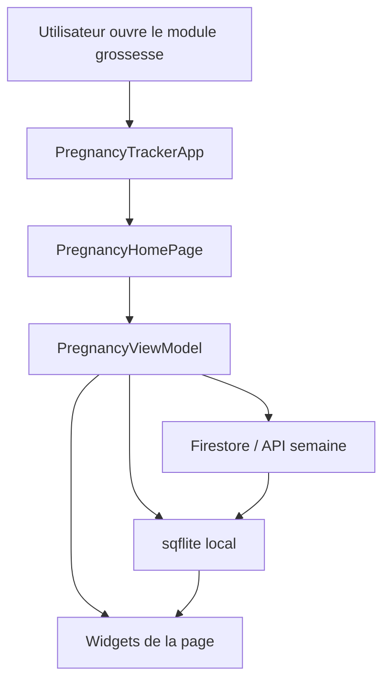

# Pages de grossesse - explication detaillee

Ce document resume les pages de grossesse de l'application Zyra, leur role, les donnees qu'elles utilisent et la navigation entre elles.

## Vue d'ensemble

Le parcours grossesse est organise autour de `PregnancyHomePage` et des pages specialisees qui affichent des informations liees a la semaine de grossesse courante.

Le flux principal est le suivant:

1. `ZyraLandingPage` ouvre l'entree du module grossesse.
2. `PregnancyTrackerApp` charge l'application grossesse.
3. `PregnancyHomePage` affiche le tableau de bord principal.
4. Les pages detaillees permettent d'explorer:
   - la croissance du bebe,
   - l'etat de la maman,
   - la nutrition,
   - les symptomes,
   - et les conseils de la semaine.

La plupart des pages lisent la semaine courante via `PregnancyViewModel`, ce qui permet d'afficher un contenu dynamique selon l'avancement de la grossesse.

## Technologies utilisees dans cette partie

Cette partie de l'application repose sur plusieurs technologies Flutter et Firebase qui travaillent ensemble pour afficher du contenu dynamique, sauvegarder l'etat utilisateur et garder une interface fluide.

### 1. Flutter et le systeme de widgets

Fichier principal de base: toutes les pages du dossier `lib/pregnancy1/view/`

Flutter est le moteur d'interface de cette section. Chaque page est construite avec des widgets comme `Scaffold`, `Column`, `Row`, `Container`, `Text`, `Image.asset` et `SingleChildScrollView`.

Role concret dans ce module:

- construire les ecrans grossesse de maniere declarative,
- gerer l'affichage responsif sur mobile,
- composer des interfaces visuelles riches avec gradients, images et cartes,
- reutiliser les memes blocs visuels entre les pages.

### 2. Dart

Fichiers principaux: tous les fichiers `.dart` du module grossesse

Dart est le langage utilise pour toute la logique du module. Il sert a:

- definir les modeles de donnees,
- calculer la semaine courante,
- choisir le trimestre,
- connecter l'interface aux donnees chargees,
- organiser la logique entre pages, view models et repositories.

### 3. Provider

Fichiers concernes: `lib/pregnancy1/viewmodels/pregnancy_view_model.dart`, `lib/pregnancy1/view/pregnancy_tracker_screen.dart`, `lib/pregnancy1/view/baby_growth_page.dart`, `lib/pregnancy1/view/mother_week_page.dart`, `lib/pregnancy1/view/baby_week_page.dart`, `lib/pregnancy1/view/nutrition_page.dart`, `lib/pregnancy1/view/conseil_week_page.dart`, `lib/pregnancy1/view/symptom_tracking_page.dart`

Le package `provider` sert a partager l'etat de grossesse dans toute l'application sans passer les donnees manuellement entre les widgets.

Dans le module grossesse, il est utilise pour:

- lire la semaine courante,
- acceder a `currentWeekInfo`,
- mettre a jour l'interface quand les donnees changent,
- synchroniser les pages avec le suivi de grossesse.

### 4. ChangeNotifier et architecture MVVM

Fichier central: `lib/pregnancy1/viewmodels/pregnancy_view_model.dart`

`PregnancyViewModel` herite de `ChangeNotifier`. Cela permet de prevenir les widgets dependants quand une valeur change.

Cette architecture suit une logique proche de MVVM:

- View: les pages Flutter qui affichent l'interface,
- ViewModel: la couche qui prepare les donnees pour l'UI,
- Model: les structures de donnees comme `PregnancyTracking` et `WeekInfo`.

Benefices dans cette partie:

- la logique de calcul n'est pas melangee avec le rendu,
- les pages restent plus simples a lire,
- les donnees sont reutilisables dans plusieurs ecrans,
- le recalcul automatique de la semaine reste centralise.

### 5. Firebase Authentication

Fichier concerne: `lib/pregnancy1/repositories/user_repository.dart`

`firebase_auth` permet d'identifier l'utilisatrice connectee. Dans ce module, cela sert surtout a:

- recuperer l'utilisateur courant,
- verifier que la personne est authentifiee avant d'enregistrer des donnees,
- lier les donnees grossesse a un compte precis.

### 6. Cloud Firestore

Fichiers concernes: `lib/pregnancy1/repositories/user_repository.dart`, `lib/pregnancy1/viewmodels/pregnancy_view_model.dart`

`cloud_firestore` est la base de donnees distante utilisee pour stocker le suivi grossesse et les symptomes.

Dans cette partie, Firestore sert a:

- charger le suivi de grossesse,
- sauvegarder la semaine, la date de debut de grossesse et les donnees associees,
- enregistrer les symptomes quotidiens,
- recuperer les profils utilisateur ou donnees associees au compte.

Point important: le module ne depend pas uniquement d'une valeur locale. Il peut reconstruire l'etat a partir de Firestore via `loadTrackingFromFirestore()`.

### 7. Stockage local avec sqflite (SQLite)

Fichiers concernes: `lib/database/db_helper.dart`, `lib/database/pregnancy_dao.dart`

`sqflite` est utilise pour gerer une base de donnees locale SQLite. Cette couche ne vit pas directement dans l'interface, mais elle fait partie du circuit de donnees du module grossesse.

Dans cette partie, SQLite sert a:

- conserver localement les donnees de grossesse,
- stocker les informations de semaine,
- garder un cache des contenus utilises par l'application,
- permettre un acces rapide meme avant la synchronisation reseau.

### Ce que fait la couche SQLite

- `DBHelper` ouvre la base locale `zyra_pregnancy.db`.
- `PregnancyDao` fournit les operations CRUD pour les donnees grossesse.
- Les tables locales `pregnancy` et `pregnancy_weeks` stockent l'etat principal et les contenus par semaine.

### Relation avec cette page

`PregnancyTrackerApp` et `PregnancyHomePage` n'appellent pas `sqflite` directement. Cette page sert uniquement a afficher le suivi et a charger les donnees via `PregnancyViewModel`.

Le stockage SQLite est geré dans la couche de donnees du module, pas dans cette page d'interface. En pratique, `sqflite` soutient donc le module en arriere-plan, mais `PregnancyTracker` ne contient pas la logique d'enregistrement locale.

### Pourquoi c'est utile

- meilleure reactivite de l'application,
- continuite de lecture hors reseau ou avec reseau instable,
- meilleure separation entre interface, logique metier et stockage.

### 8. Calculs de grossesse

Fichiers concernes: `lib/pregnancy1/services/pregnancy_calculator.dart`, `lib/pregnancy1/viewmodels/pregnancy_view_model.dart`, `lib/pregnancy1/repositories/user_repository.dart`

Le service `PregnancyCalculator` centralise les calculs metiers:

- semaine de grossesse actuelle,
- trimestre,
- date d'accouchement estimee,
- jours restants,
- jours dans la semaine en cours.

Cette technologie logique est importante car elle garantit que le module affiche des donnees medicalement coherentes et non des valeurs figees.

### 9. Donnees de semaine et contenu dynamique

Fichiers concernes: `lib/pregnancy1/models/week_info.dart`, `lib/pregnancy1/services/week_data_service.dart`

Les textes et metadonnees de grossesse sont charges via des donnees de semaine. Le module utilise ces informations pour afficher:

- le developpement du bebe,
- les conseils a la maman,
- les recommandations nutritionnelles,
- les images ou assets associes a la semaine.

Cela rend chaque ecran contextuel et adapte a l'etape de grossesse.

### 10. Assets locaux et illustration

Fichiers concernes: `assets/images/`, `assets/imagesBaby/`, `assets/nutrition.json`

Cette partie utilise des ressources locales pour enrichir l'interface:

- images d'illustration,
- visuels du bebe par semaine,
- illustrations pour la maman et les conseils,
- donnees nutritionnelles structurees.

L'utilisation d'assets locaux donne un chargement rapide et un rendu stable meme sans reseau.

### 11. Navigation Flutter

Fichiers concernes: `lib/pregnancy1/view/shared_navigation.dart`, `lib/pregnancy1/view/first_page_pregnancy.dart`, `lib/pregnancy1/view/pregnancy_tracker_screen.dart`

La navigation repose sur `Navigator.push` pour ouvrir certaines pages, puis sur une barre de navigation commune pour passer d'un onglet a l'autre.

Role concret:

- guider l'utilisatrice entre les grandes sections,
- garder la navigation simple,
- conserver le contexte de grossesse pendant le parcours.

### 12. Gestion d'etat locale et scrolling

Fichiers concernes: `lib/pregnancy1/view/baby_growth_page.dart`, `lib/pregnancy1/view/pregnancy_tracker_screen.dart`

Le module utilise aussi des mecanismes Flutter natifs comme `ScrollController`, `StatefulWidget` et `setState` pour des besoins locaux:

- positionner la timeline sur la semaine courante,
- mettre a jour certains composants visuels,
- gerer les interactions utilisateur.

### 13. Material Design

Fichiers concernes: toutes les pages du module

`MaterialApp`, `Scaffold`, `AppBar`, les icones Material et les composants d'interface Material assurent une base visuelle standardisee.

Dans cette partie, Material Design est adapte avec:

- une palette rose-violet personnalisee,
- des cartes arrondies,
- des ombres douces,
- des gradients,
- des boutons et icones coerents sur tout le module.

## Pourquoi ces technologies ensemble

L'interet de cette combinaison est simple:

- Flutter gere le rendu.
- Dart porte la logique.
- Provider et ChangeNotifier propagent l'etat.
- Firestore conserve les donnees persistantes.
- PregnancyCalculator calcule les informations medicales de base.
- Les assets locaux assurent un rendu riche et rapide.

Ensemble, elles permettent a la partie grossesse d'etre a la fois dynamique, lisible et maintenable.

## Mini rapport technique du module grossesse

Cette partie du projet peut etre lue comme une petite architecture en couches.

### Objectif fonctionnel

Le module grossesse sert a afficher un tableau de bord de grossesse dynamique, a adapter le contenu a la semaine courante, et a conserver l'etat utilisateur meme en cas de connexion instable.

### Chaîne de donnees principale

### Flux concret au demarrage

1. L'application affiche `PregnancyTrackerApp`.
2. `PregnancyHomePage` demande au `PregnancyViewModel` de charger le suivi.
3. Le ViewModel verifie l'etat de connexion.
4. Si internet est disponible, il charge les donnees distantes puis les met en cache local.
5. Si internet n'est pas disponible, il lit directement les donnees dans `sqflite`.
6. L'interface se reconstruit avec `Provider` et `ChangeNotifier`.

### Responsabilite de chaque couche

- `view/` : affiche les ecrans et gere la navigation.
- `viewmodels/` : prepare les donnees, calcule la semaine courante, decide quelle source lire.
- `repositories/` : parle a Firestore et centralise l'acces aux donnees utilisateur.
- `database/` : garde une copie locale des donnees de grossesse.
- `services/` : fournit les calculs metier, le contenu de semaine et le test de connectivite.
- `models/` : represente les objets `PregnancyTracking` et `WeekInfo`.

### Donnees stockees localement

La base SQLite ne doit garder que les informations utiles au suivi de grossesse:

- date des dernieres regles,
- semaine courante recalculable,
- jours dans la semaine en cours,
- jours restants,
- trimestre,
- date prevue d'accouchement,
- contenu de la semaine courante,
- image et conseils associes a la semaine.

### Ce que chaque page consomme

- `PregnancyHomePage` : resume global, semaine courante, conseil du jour.
- `BabyGrowthPage` : evolution du bebe, timeline, trimestre, visuels.
- `MotherWeekPage` : contexte maternel et textes adaptes a la semaine.
- `BabyWeekPage` : details du developpement du bebe.
- `HealthyNutritionPage` : conseils nutritionnels selon la semaine.
- `TipsWeekPage` : recommandations pratiques et bien-etre.
- `SymptomTrackingPage` : symptomes quotidiens et historique.

### Comportement hors ligne

Le module est maintenant pense pour rester exploitable sans reseau:

- si la donnee existe en local, la page peut s'ouvrir sans attendre le cloud,
- les semaines deja chargees sont recuperees depuis `sqflite`,
- le contenu affiche reste coherent avec la semaine recalculée localement,
- l'application garde ainsi une experience plus stable lors des coupures reseau.

### Point important d'architecture

La source de verite fonctionnelle reste le `PregnancyViewModel`, pas la page Flutter elle-meme. Les pages ne font qu'afficher l'etat courant; elles ne calculent pas directement la logique metier.

## Synthese technique courte

En resume, le module grossesse est construit autour de trois idees simples:

- calculer la grossesse a partir de la date LMP,
- afficher un contenu dynamique selon la semaine courante,
- maintenir un cache local SQLite pour les cas hors ligne.

Cela donne un module plus robuste, plus rapide au redemarrage, et plus facile a maintenir.

## 1. Page d'entree: `ZyraLandingPage`

Fichier: `lib/pregnancy1/view/first_page_pregnancy.dart`

Cette page est la porte d'entree visuelle du module grossesse. Elle affiche:

- un fond illustratif,
- un titre "PREGNANCY",
- un texte d'accroche,
- un bouton `Get Started`.

Role principal:

- guider l'utilisatrice vers le module grossesse,
- lancer `PregnancyTrackerApp` quand le bouton est presse.

Cette page ne manipule pas les donnees de grossesse elle-meme. Elle sert surtout d'introduction et de transition.

## 2. Application principale grossesse: `PregnancyTrackerApp`

Fichier: `lib/pregnancy1/view/pregnancy_tracker_screen.dart`

Cette classe encapsule le module grossesse dans une `MaterialApp` dediee. Elle charge:

- le theme general,
- `PregnancyHomePage` comme page principale,
- la navigation bas de page commune.

Role principal:

- fournir un environnement isole pour le module grossesse,
- centraliser l'acces au tableau de bord et aux pages secondaires.

## 3. Tableau de bord: `PregnancyHomePage`

Fichier: `lib/pregnancy1/view/pregnancy_tracker_screen.dart`

C'est la page d'accueil du suivi grossesse. Elle charge les donnees via `PregnancyViewModel` et affiche un tableau de bord compose de:

- statistiques principales,
- calendrier de semaine,
- conseil du jour,
- acces rapide vers les autres sections.

### Ce que la page montre

- la semaine de grossesse courante,
- une synthese visuelle de l'etat actuel,
- un acces rapide aux pages de croissance, nutrition et symptomes,
- des donnees adaptees a la semaine active grace a `currentWeekInfo`.

### Comportement important

Au chargement, la page appelle `loadTrackingFromFirestore()` pour recuperer le suivi depuis Firestore. Si aucune donnee n'est disponible, elle affiche un message explicite.

## 4. Page de croissance du bebe: `BabyGrowthPage`

Fichier: `lib/pregnancy1/view/baby_growth_page.dart`

C'est une des pages les plus riches du module. Elle presente la croissance du bebe semaine par semaine.

### Sections principales

- hero de la semaine courante,
- progression de la grossesse,
- timeline des semaines,
- cartes d'information,
- parcours detaille par trimestre.

### Donnees utilisees

La page lit:

- `pregnancyTracking?.currentWeek` pour connaitre la semaine courante,
- `currentWeekInfo` pour recuperer les informations specifiques a la semaine,
- les assets du bebe via `babyWeekAsset(currentWeek)`.

### Ce que l'utilisateur voit

- la semaine actuelle,
- le poids et la taille estimative du bebe,
- un indicateur de trimestre dynamique,
- une timeline visuelle des semaines 1 a 40,
- un detail de croissance organise par trimestre.

### Point important

Le trimestre ne doit pas etre statique. Il doit etre calcule a partir de la semaine courante:

- semaines 1 a 13: premier trimestre,
- semaines 14 a 27: deuxieme trimestre,
- semaines 28 a 40: troisieme trimestre.

Cela permet d'eviter un affichage faux quand la semaine evolue.

## 5. Page de la maman: `MotherWeekPage`

Fichier: `lib/pregnancy1/view/mother_week_page.dart`

Cette page explique les changements et conseils pour la maman selon la semaine de grossesse.

### Sections principales

- afficheur de semaine en haut,
- grande illustration,
- texte explicatif sur la menstruation, la fertilite ou le contexte maternel,
- carte d'information complementaire.

### Donnees utilisees

- `currentWeek` depuis `PregnancyViewModel`,
- `currentWeekInfo?.pregnancyInfo` pour le texte dynamique.

### Role

Cette page aide a comprendre ce qui se passe du cote maternel et comment la grossesse evolue pour la maman.

## 6. Page du bebe: `BabyWeekPage`

Fichier: `lib/pregnancy1/view/baby_week_page.dart`

Cette page decrit le developpement du bebe pour la semaine en cours.

### Sections principales

- la semaine courante,
- une illustration du bebe,
- un texte detaille sur le developpement,
- une carte avec une comparaison visuelle de taille.

### Donnees utilisees

- `currentWeek` depuis `PregnancyViewModel`,
- `currentWeekInfo?.babyDevelopmentDetails` pour le texte dynamique.

### Role

Elle met l'accent sur la croissance du bebe, ses organes, ses sens et son evolution globale.

## 7. Page nutrition: `HealthyNutritionPage`

Fichier: `lib/pregnancy1/view/nutrition_page.dart`

Cette page donne des recommandations nutritionnelles pour la grossesse.

### Sections principales

- statistiques nutritionnelles rapides,
- resume de la semaine,
- aliments a eviter,
- categories nutritionnelles,
- recommandations hebdomadaires.

### Donnees utilisees

- `PregnancyViewModel` pour la semaine courante,
- `NutritionViewModel` pour les recommandations,
- l'etat de grossesse pour activer ou non les conseils.

### Comportement important

La page ecoute les changements du suivi grossesse. Si la semaine change, les conseils nutritionnels se recalculent automatiquement.

## 8. Page conseils maman: `TipsWeekPage`

Fichier: `lib/pregnancy1/view/conseil_week_page.dart`

Cette page affiche des conseils adaptes a la semaine de grossesse.

### Sections principales

- rappel de la semaine actuelle,
- image d'illustration,
- texte de conseils,
- carte "Petit conseil" avec recommandation simple.

### Donnees utilisees

- `currentWeek` depuis `PregnancyViewModel`,
- `currentWeekInfo?.motherTips` pour le texte dynamique.

### Role

Elle sert de page de conseils pratiques, orientee bien-etre et prevention.

## 9. Page de suivi des symptomes: `SymptomTrackingPage`

Fichier: `lib/pregnancy1/view/symptom_tracking_page.dart`

Cette page permet a l'utilisatrice de suivre ses symptomes et son ressenti quotidien.

### Fonctionnalites principales

- selection de l'humeur,
- selection de symptomes,
- intensite des symptomes,
- notes personnelles,
- historique des symptomes.

### Donnees utilisees

- `UserRepository` pour sauvegarder et recuperer les symptomes,
- la date du jour pour l'historique,
- les donnees de grossesse pour le contexte.

### Role

Elle aide a documenter l'etat de sante quotidien et a conserver un historique exploitable.

## 10. Navigation commune

Fichier: `lib/pregnancy1/view/shared_navigation.dart`

La barre de navigation du bas relie les grandes sections du module:

- Home,
- Growth,
- Nutrition,
- Symptoms,
- Posts,
- Articles.

Cette navigation est partagee pour donner une experience coherente d'une page a l'autre.

## 11. En-tete commun

Fichier: `lib/pregnancy1/view/shared_header.dart`

Les pages grossesse reutilisent un en-tete commun pour homogeniser le design et le titre de section.

## Resume fonctionnel

En pratique, le module grossesse fonctionne ainsi:

- la page d'entree lance l'acces au module,
- le tableau de bord centralise les donnees principales,
- les pages detaillees expliquent la situation de la semaine courante,
- la nutrition et les symptomes sont adaptes au suivi en cours,
- le trimestre et la semaine doivent rester dynamiques pour refleter la progression reelle.

## Points a retenir

- La source de verite est `PregnancyViewModel`.
- La semaine courante pilote la plupart des contenus.
- Le trimestre doit etre calcule, pas ecrit en dur.
- Les pages detaillees sont complementaires et reprennent le meme contexte temporel.

## Fichiers principaux

- `lib/pregnancy1/view/first_page_pregnancy.dart`
- `lib/pregnancy1/view/pregnancy_tracker_screen.dart`
- `lib/pregnancy1/view/baby_growth_page.dart`
- `lib/pregnancy1/view/mother_week_page.dart`
- `lib/pregnancy1/view/baby_week_page.dart`
- `lib/pregnancy1/view/nutrition_page.dart`
- `lib/pregnancy1/view/conseil_week_page.dart`
- `lib/pregnancy1/view/symptom_tracking_page.dart`
- `lib/pregnancy1/view/shared_navigation.dart`
- `lib/pregnancy1/view/shared_header.dart`
